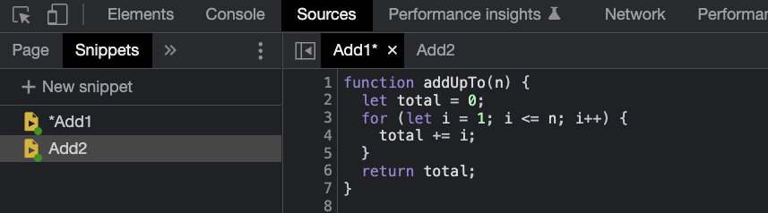

## 1. 자바스크립트 알고리즘 & 자료구조 강의

알고리즘, 자료구조를 제대로 이해하고자 Udemy 할인 기간에 강의를 구매했다.

[【한글자막】 JavaScript 알고리즘 & 자료구조 마스터클래스](https://www.udemy.com/course/best-javascript-data-structures/)

하루 2강씩 듣고 필요하다면 내용을 해당 블로그에 정리해 나갈 예정이다.

그 첫번째로는 Big O 표기법에 대한 필요성을 고찰하기 위해 같은 동작을 하는 다른 두 가지 코드를 가져와 비교해 보는 시간을 가졌다.

## 2. 코드를 서로 비교하고 성능을 평가하는 방법

코드를 작성하면서 어떤 하나의 문제에 대한 여러 가지 솔루션이 있는 경우가 많다. 이 중 무엇이 최선인가를 고민해야 하는 순간이 오게 된다.

단순히 제대로 작동만 하면 되지 성능을 굳이 따지는 이유는 서비스를 개발할 때, 코드를 디버그 할 때 코드를 느리게 만드는 것이 무엇인지 알고 성능을 최적화 하는 것이 중요하기 때문이다.

- It’s important to have a precise vocabulary to talk about how our code performs

- Useful for discussing trade-offs between different approaches

- When your code slows down or crashes, identifying parts of the code that are inefficient can help us find pain points in our applications

## 3. 구글 개발자 도구 > Sources > Snippets

아래 이미지 처럼, 구글 개발자 도구 > Sources > Snippets 선택 하여 각각의 함수 스니펫을 생성하고 테스트해 볼 수 있다.



## 4. 같은 결과, 다른 코드

1에서 n까지의 모든 숫자의 합을 계산하는 함수 2종류가 있다.

- 타입 1

반복문을 돌면서 변수 total 에 값을 더해나간 뒤 i 가 n 보다 커지면 total 값을 리턴하는 함수이다.

```js
function addUpTo(n) {
  let total = 0
  for (let i = 1; i <= n; i++) {
    total += i
  }
  return total
}
```

- 타입 2

반복문이 아닌 어떤 공식을 사용한 것으로 보여지는 코드이다.

```js
function addUpTo(n) {
  return (n * (n + 1)) / 2
}
```

두 코드는 같은 결과를 보여주지만 다른 코드이다.
스니펫에 아래의 코드를 추가하고 각각의 타입 함수마다 실행해보면 함수를 실행하는데 걸린 초가 나온다.

```js
let t1 = performance.now()
addUpTo(1000000000)
let t2 = performance.now()
console.log(`Time Elapsed: ${(t2 - t1) / 1000} seconds.`)
```

타입 2의 코드가 걸린 시간이 짧게 나오지만 같은 기기라도 다른 시간이 출력되기도 하고, 무엇보다 매번 이런 방식으로 걸린 시간을 구해 어떤 코드가 더 속도가 빨리 나오는지를 가늠하는 것은 어려운 일이다.

이를 위해 <b>BigO 표기법</b>을 알아야 한다.

---

## Source

- 나무위키 점근 표기법

  [<https://namu.wiki/w/%EC%A0%90%EA%B7%BC%20%ED%91%9C%EA%B8%B0%EB%B2%95>](https://namu.wiki/w/%EC%A0%90%EA%B7%BC%20%ED%91%9C%EA%B8%B0%EB%B2%95)
